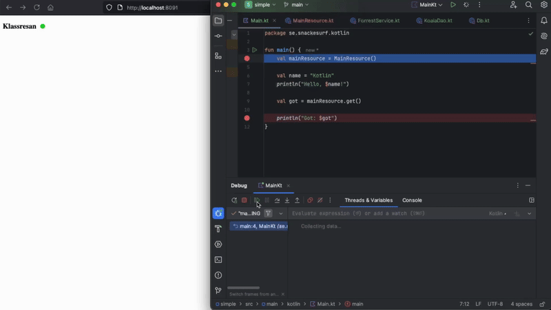
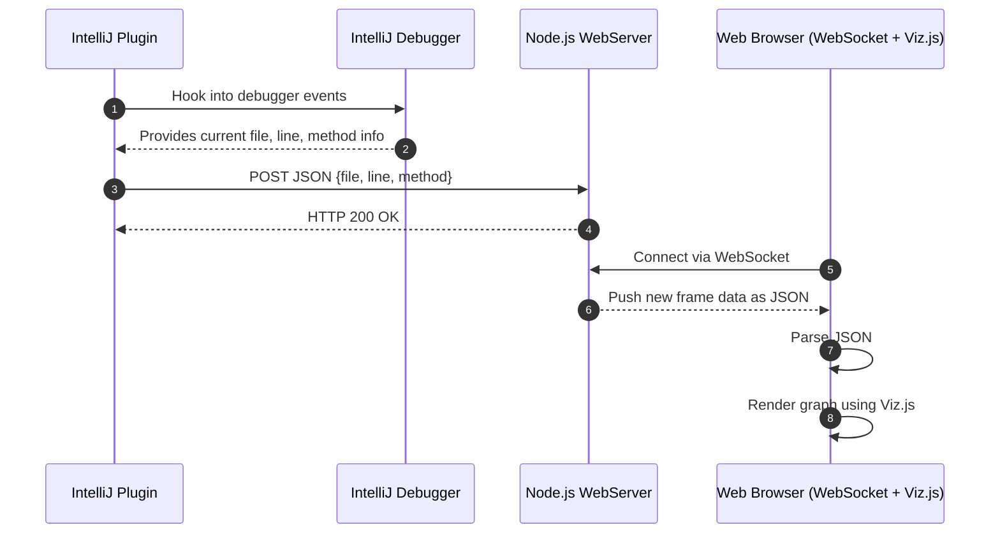

# Klassresan

Tools for visualizing code, focus on java/kotlin in intellij.

## [Intellj Plugin](intellij-plugin/)
Extension for [Intellij](https://www.jetbrains.com/idea/) that hooks into the debugger and posts details of stack frames over HTTP. Download the extension as a zip from [releases](https://github.com/nilsheuman/klassresan/releases/).

## [Intellj Client](intellij-client/)
NodeJS Server that receives those frames and exposes a websocket. It serves a simple web page draws graphs with [graphvis](https://github.com/mdaines/viz-js).

# How it works

# Resources

Inspired from https://github.com/timKraeuter/VisualDebugger

Based of https://github.com/JetBrains/intellij-sdk-code-samples/tree/main/tool_window
