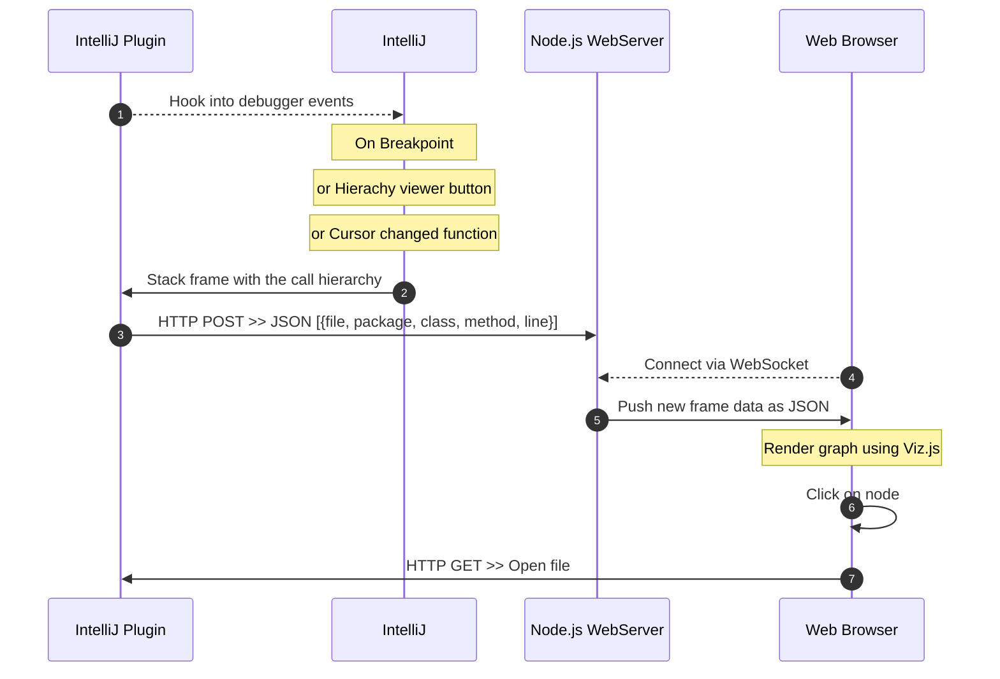
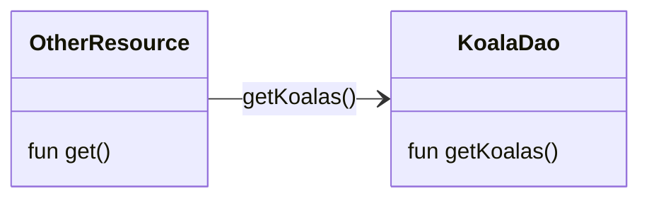

# Klassresan

Tools for visualizing code, focus on java/kotlin in intellij.

## [Intellj Plugin](intellij-plugin/)
Extension for [Intellij](https://www.jetbrains.com/idea/) that:
- Sends code hierarchy to an external webserver as POST request.
- Adds a button to the hierarchy viewer to send the class hierarchy.
- Hooks into the debugger and posts details of stack frames.
- Sends the current open file.
- Exposes a webserver to allow opening of files in intellij.

Download the extension as a zip from [releases](https://github.com/nilsheuman/klassresan/releases/).

## [Intellj Client](intellij-client/)
NodeJS Server that receives the code hierarchy and exposes a websocket for its client. It serves a simple web page that draws graphs with [graphvis](https://github.com/mdaines/viz-js).

Clicking the nodes will open their corresponding files in Intellij.

To use it, clone the repo, enter intellij-client folder, run `npm install`, `npm start` and access web ui on http://localhost:8091

# How it works




## Hierarchy Structure
Sample hierarchy, each tree will be sent like this, with the leaf at the top.

The source in the path is ignored by the server.

```
POST http://<server>:<port>/<source>
```

```json
[
  {
    "fileName": "",
    "filePath": "",
    "clazz": "KoalaDao",
    "pkg": "se.snackesurf.kotlin",
    "method": "getKoalas",
    "line": 20,
    "offset": 0,
    "source": "hierarchy"
  },
  {
    "fileName": "",
    "filePath": "",
    "clazz": "OtherResource",
    "pkg": "se.snackesurf.kotlin",
    "method": "get",
    "line": 10,
    "offset": 0,
    "source": "hierarchy"
  }
]
```

So this symbolises:



# Open File Endpoint

Currently two methods of opening a file, by passing the package and class name or the full path to the file.

```
GET http://<intellijServer:port>/open?fq=<full.package.Class>
```

```
GET http://<intellijServer:port>/open?path=<absolute/path/to/file.ext>&line=<optionalLineNumber>
```


# Resources

Inspired from https://github.com/timKraeuter/VisualDebugger

Based of https://github.com/JetBrains/intellij-sdk-code-samples/tree/main/tool_window
