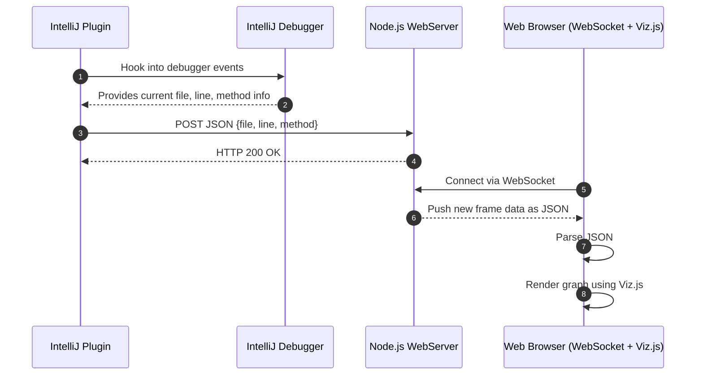

# Klassresan

Tools for visualizing code, focus on java/kotlin in intellij

## [Intellj Plugin](intellij-plugin/)
Is a extension for [Intellij](https://www.jetbrains.com/idea/) that hooks into the debugger and posts stack frames over http.

## [Intellj Client](intellij-client/)
Is a nodejs server that receives those frames and exposes a websocket, that a simple web page draws graphs with [graphvis](https://github.com/mdaines/viz-js)

# How it works

Inspired from https://github.com/timKraeuter/VisualDebugger